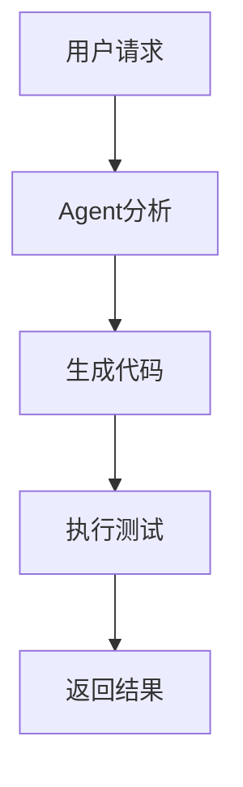

# Cursor进阶使用指南：掌握最新AI编程助手功能

## 前言

最近Cursor迎来一波大的更新，发布了它1.0版本的更新！从这个版本号来说，大家就应该明白了——这对于Cursor而言，是多么重要的节点。它上个版本还是0.50，这个版本直接跳到了1.0，这跨度比我从单身跳到已婚还大！🚀

这说明Cursor的开发团队已经认为它进入了一个成熟的、正式版本的阶段。可能大家对于1.0更新了什么还不太了解，甚至0.50版本也没看过（别担心，你不是一个人），那么你就来对了！这篇文章将带你深入了解Cursor的最新更新——到底什么新功能敢让它装这波大的？

本文基于Cursor官方最新的更新日志（截至2025年8月），话不多说，系好安全带，准备发车！🏎️

## 🚀 重磅更新：Agent功能全面升级（v1.4）

### 1. 更强的Agent可控性

**新特性：实时消息引导**
- 在Cursor工作时发送消息，现在能更好地引导Agent的行为
- 消息会在理想时机（通常是工具调用后）运行，而不是等待生成完成
- 快捷键优化：
  - `⌥+Enter`（Windows: `Alt+Enter`）：排队消息（原有行为）
  - `⌘+Enter`（Windows: `Ctrl+Enter`）：立即中断Agent发送消息

**实用场景：**
```
当Agent正在重构代码时，你突然想到需要保留某个特定函数，
现在可以立即发送消息进行引导，而不用等待整个重构完成。
```

### 2. Agent工具能力大幅提升

**文件读取优化：**
- 移除了2MB文件大小限制
- 智能判断何时读取完整文件

**目录探索增强：**
- 一次调用即可探索完整目录树
- 提供文件数量和类型等元数据

**搜索功能改进：**
- Grep搜索：减少噪音，匹配更精准
- 代码库搜索：更好的排序和索引，提供更相关的上下文
- Web搜索：使用轻量级原生模型，响应更小更相关

### 3. 多模型并行使用

现在你可以为不同的Agent分配不同的模型：
- 每个标签页和编辑器中的Agent可以使用不同模型
- Fork Agent时会保留所选模型
- 适合不同任务使用最适合的模型

**使用建议：**
- 代码生成任务：使用Claude Sonnet
- 文档编写：使用GPT-4
- 快速问答：使用更轻量的模型

### 4. 使用情况可视化

新增使用统计功能：
- 在聊天界面查看使用统计
- 支持全时间或超过计划配额50%时的查看
- 团队和企业用户将在9月获得使用摘要功能

## 🔧 终端集成与上下文优化（v1.3）

### 共享终端功能

Agent现在可以使用你的本地终端：
- 需要时自动创建新终端
- 后台运行，点击Focus可前置查看
- 可以看到Agent执行的命令，也可以接管控制

**实际应用：**
```bash
# Agent可以直接执行这些命令
npm install
git commit -m "feat: 添加新功能"
python manage.py migrate
```

### 上下文使用情况显示

在对话结束时，现在可以看到：
- 上下文窗口使用了多少
- 帮助你优化对话策略，避免超出限制

### 编辑速度提升

- 搜索替换编辑延迟减少25%
- 应用编辑延迟减少11%
- 通过懒加载linter错误实现优化

## 📋 智能任务规划（v1.2）

### Agent待办事项功能

这是一个革命性的功能：
- Agent会为长期任务创建结构化待办清单
- 任务分解包含依赖关系
- 实时更新进度，保持上下文新鲜
- 支持Slack集成显示

**示例待办清单：**
```
1. [进行中] 分析现有代码结构
2. [待处理] 重构用户认证模块
3. [待处理] 更新相关测试用例
4. [待处理] 更新文档
```

### 消息队列功能

- 可以为Agent排队多个后续消息
- 重新排序任务优先级
- 无需等待即可开始执行

### PR索引和搜索

Cursor现在可以：
- 索引和总结Pull Request
- 语义搜索历史PR
- 获取PR、issue、commit或分支到上下文
- 包含GitHub评论和BugBot审查

## 🤖 Background Agent全面可用（v1.0-v1.1）

### Slack集成

**直接在Slack中使用：**
- 在任何频道中@Cursor启动Background Agent
- Agent读取整个Slack线程理解上下文
- 在GitHub中创建PR，无需离开对话

**使用示例：**
```
@Cursor 请帮我修复用户登录页面的响应式布局问题，
参考我们之前讨论的设计规范。
```

### Jupyter Notebook支持

- Agent现在可以在Jupyter Notebook中实现更改
- 直接创建和编辑多个单元格
- 特别适合研究和数据科学任务
- 目前仅支持Sonnet模型

## 🔍 代码审查自动化：Bugbot

### 自动PR审查

Bugbot会：
- 自动审查你的Pull Request
- 发现潜在bug和问题
- 在GitHub PR中留下评论
- 提供"在Cursor中修复"的一键链接

**工作流程：**
1. 提交PR到GitHub
2. Bugbot自动审查代码
3. 发现问题并评论
4. 点击链接回到Cursor修复
5. 自动生成修复提示

## 💾 记忆功能（Memories）

### 智能上下文记忆

- Cursor可以记住对话中的事实
- 在未来对话中引用这些记忆
- 按项目存储，个人级别管理
- 可在设置中管理所有记忆

**使用场景：**
```
第一次对话：告诉Cursor你的项目使用React + TypeScript
后续对话：Cursor会自动记住并在代码建议中应用这些信息
```

## 🔧 MCP集成优化

### 一键安装MCP服务器

- 支持OAuth认证
- 官方精选MCP服务器列表
- 开发者可添加"Add to Cursor"按钮
- 简化第三方工具集成

## 📊 可视化增强

### 富文本聊天响应

Cursor现在可以在对话中渲染：
- Mermaid图表
- Markdown表格
- 其他可视化内容

**示例：**


## 🎯 实用技巧和最佳实践

### 1. 合理使用不同Agent模式

- **前台Agent**：适合实时编码和调试
- **后台Agent**：适合大型重构和长期任务
- **Slack Agent**：适合团队协作和异步任务

### 2. 优化上下文使用

- 利用新的上下文使用显示功能
- 合理分割长对话
- 使用记忆功能减少重复说明

### 3. 充分利用工具集成

- 配置MCP服务器扩展功能
- 使用Bugbot进行代码质量保证
- 利用PR索引功能进行代码审查

### 4. 团队协作优化

- 设置Slack集成提高团队效率
- 使用Background Agent处理异步任务
- 利用待办事项功能跟踪长期项目

## 🔮 未来展望

根据更新日志的趋势，Cursor正在朝着以下方向发展：

1. **更智能的上下文理解**：通过记忆和PR索引功能
2. **更好的团队协作**：Slack集成和Background Agent
3. **更强的工具生态**：MCP集成和第三方工具支持
4. **更高的代码质量**：Bugbot和自动化审查

## 结语

Cursor的这些新功能不仅仅是技术升级，更是编程工作流的革命。从智能任务规划到自动代码审查，从团队协作到个性化记忆，每一个功能都在让编程变得更加高效和智能。

作为程序员，我们应该：
1. **积极尝试新功能**：不要停留在舒适区
2. **建立新的工作流**：结合这些功能优化日常开发
3. **关注团队协作**：利用Slack集成等功能提升团队效率
4. **持续学习**：跟上AI编程助手的发展步伐

记住，工具只是手段，关键是如何将这些强大的功能融入到你的实际开发工作中。开始尝试这些新功能，让Cursor成为你编程路上最得力的助手吧！

---

*本文基于Cursor官方更新日志整理，建议定期查看官方文档获取最新功能信息。*

**相关链接：**
- [Cursor官方网站](https://cursor.com)
- [Cursor更新日志](https://cursor.com/changelog)
- [Cursor文档](https://docs.cursor.com)
