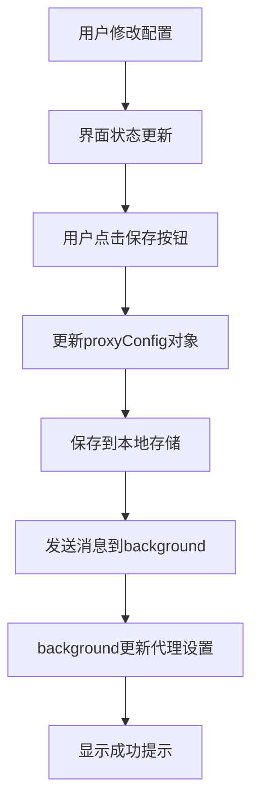

# 代理功能优化说明

## 优化内容

根据用户需求，对宇航工具箱插件的代理功能进行了以下优化：

### 🎯 核心改进

#### 1. 配置生效机制优化
- **修改前**：配置修改后立即生效，可能导致不稳定
- **修改后**：只有点击"保存"按钮后所有配置才会生效，确保稳定性

#### 2. 默认配置调整
- **代理开关**：默认关闭（isRuleUse: false）
- **应用代理**：默认勾选（proxyEnable: true）

#### 3. 用户体验优化
- 移除了实时监听和自动保存功能
- 增加了操作提示信息
- 保存成功后显示明确的反馈

## 具体修改点

### 📱 界面默认值调整

1. **拦截规则开关**：默认为关闭状态
   ```html
   <!-- 修改前 -->
   <input type="checkbox" id="isRuleUse" checked>
   
   <!-- 修改后 -->
   <input type="checkbox" id="isRuleUse">
   ```

2. **应用代理选项**：默认为勾选状态
   ```html
   <!-- 修改前 -->
   <input type="checkbox" id="proxyEnable">
   
   <!-- 修改后 -->
   <input type="checkbox" id="proxyEnable" checked>
   ```

### ⚙️ 配置数据默认值

**sidepanel.js**：
```javascript
// 修改前
let proxyConfig = {
  isRuleUse: true,
  proxyEnable: false,
  // ...
};

// 修改后
let proxyConfig = {
  isRuleUse: false,
  proxyEnable: true,
  // ...
};
```

**background.js**：
```javascript
// 修改前
let currentProxyConfig = {
  isRuleUse: false,
  proxyEnable: false,
  // ...
};

// 修改后
let currentProxyConfig = {
  isRuleUse: false,
  proxyEnable: true,
  // ...
};
```

### 🔄 事件处理机制优化

#### 移除实时监听
- 删除了开关状态的实时监听事件
- 删除了代理启用状态的实时监听事件
- 移除了规则修改后的自动保存

#### 保留手动保存
- 只在点击"保存"按钮时触发配置更新
- 保存成功后显示明确反馈

### 📝 操作提示优化

1. **添加规则提示**：
   ```
   已添加新规则，请点击保存按钮应用配置
   ```

2. **删除规则提示**：
   ```
   已删除 X 条规则，请点击保存按钮应用配置
   ```

3. **保存成功提示**：
   ```
   代理配置已保存并生效
   ```

## 使用流程

### 🚀 配置代理的正确流程

1. **打开代理功能**：
   - 点击插件图标
   - 切换到"代理"标签页

2. **配置参数**：
   - 设置拦截URL（默认：`/gateway/`）
   - 输入代理地址（如：`172.30.12.205`）
   - 根据需要开启/关闭拦截规则开关
   - 根据需要勾选/取消应用代理选项

3. **配置规则**：
   - 点击"增加规则"添加新的重定向规则
   - 在表格中输入"匹配前"和"匹配后"的字符串
   - 勾选"应用"列来启用特定规则

4. **应用配置**：
   - **重要**：点击"保存"按钮使所有配置生效
   - 等待"代理配置已保存并生效"的成功提示

### ⚠️ 注意事项

1. **必须保存**：任何配置修改都必须点击保存按钮才能生效
2. **默认状态**：新安装的插件代理功能默认关闭，应用代理默认勾选
3. **稳定性**：配置只在保存时生效，避免了频繁切换导致的不稳定

## 技术细节

### 🔧 代码结构优化

#### 事件绑定简化
```javascript
// 移除了实时监听
// newIsRuleUse.addEventListener('change', (e) => { ... });
// newProxyEnable.addEventListener('change', (e) => { ... });

// 保留统一的保存机制
newSaveButton.addEventListener('click', () => {
  // 更新所有配置
  if (interceptUrl) proxyConfig.interceptUrl = interceptUrl.value;
  if (isRuleUse) proxyConfig.isRuleUse = isRuleUse.checked;
  if (proxyIp) proxyConfig.proxyIp = proxyIp.value;
  if (proxyEnable) proxyConfig.proxyEnable = proxyEnable.checked;
  
  // 统一保存并应用
  saveProxyConfigData();
});
```

#### 规则管理优化
```javascript
// 添加规则时不自动保存
function addNewRule() {
  // 添加规则到配置
  proxyConfig.ruleTableData.push(newRule);
  renderRuleTable();
  
  // 提示用户需要保存
  showStatus('已添加新规则，请点击保存按钮应用配置', 'info');
}
```

### 📊 配置生效流程



## 优化效果

### ✅ 稳定性提升
- 避免了频繁的配置切换
- 减少了意外的代理状态变化
- 统一的配置生效时机

### ✅ 用户体验改善
- 明确的保存操作流程
- 清晰的状态反馈
- 更好的默认配置

### ✅ 功能完整性
- 保持了所有原有功能
- 不影响其他插件功能
- 向后兼容现有配置

---

**总结**：通过这次优化，代理功能变得更加稳定可靠，用户操作更加明确，有效解决了"时好时坏"的问题。 